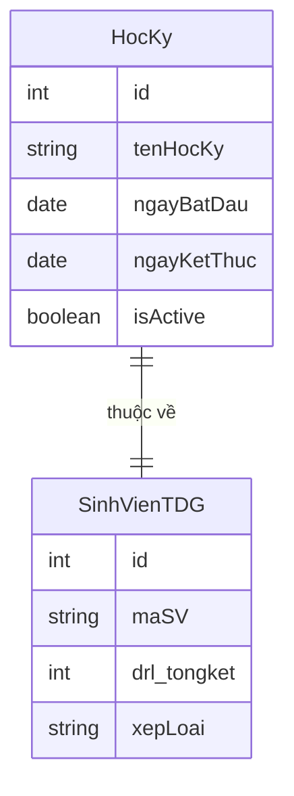
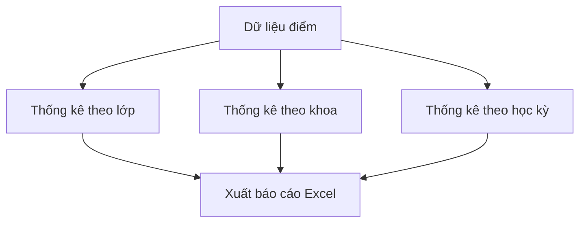
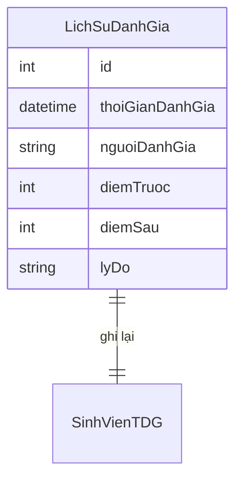
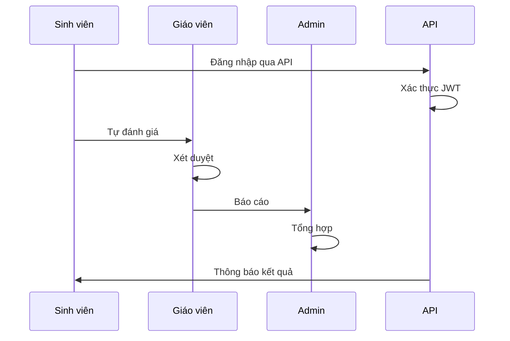
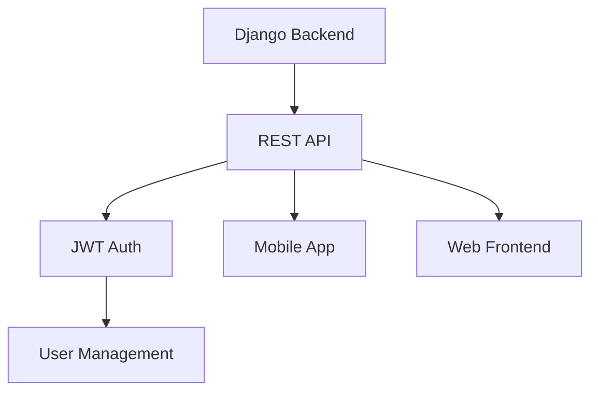

# Kế hoạch phát triển chức năng hệ thống quản lý điểm rèn luyện

## 1. Quản lý học kỳ

### 1.1 Mô hình dữ liệu


### 1.2 Chức năng cần bổ sung
- Tạo và quản lý thông tin học kỳ
- Thiết lập học kỳ hiện tại
- Khóa/mở đánh giá điểm theo học kỳ
- Hiển thị lịch sử điểm theo học kỳ
- API để đồng bộ dữ liệu học kỳ với ứng dụng mobile

### 1.3 API Endpoints
```
GET /api/v1/semester/current
POST /api/v1/semester/create
PUT /api/v1/semester/{id}
DELETE /api/v1/semester/{id}
GET /api/v1/semester/{id}/scores
```

## 2. Hệ thống báo cáo

### 2.1 Loại báo cáo
- Báo cáo tổng hợp điểm rèn luyện theo lớp
- Báo cáo thống kê xếp loại theo khoa
- Báo cáo chi tiết điểm rèn luyện của sinh viên
- Xuất dữ liệu ra file Excel
- API để truy xuất báo cáo từ mobile app

### 2.2 Biểu đồ thống kê


### 2.3 API Endpoints
```
GET /api/v1/reports/class/{class_id}
GET /api/v1/reports/faculty/{faculty_id}
GET /api/v1/reports/student/{student_id}
GET /api/v1/reports/export/excel
POST /api/v1/reports/generate
```

## 3. Lưu trữ lịch sử đánh giá

### 3.1 Mô hình dữ liệu


### 3.2 Chức năng
- Ghi lại mỗi lần thay đổi điểm 
- Hiển thị lịch sử thay đổi
- Khôi phục điểm về phiên bản trước
- Xuất lịch sử đánh giá
- API để truy xuất và cập nhật lịch sử

### 3.3 API Endpoints
```
GET /api/v1/history/student/{student_id}
GET /api/v1/history/score/{score_id}
POST /api/v1/history/revert/{history_id}
GET /api/v1/history/export
```

## 4. Phân quyền chi tiết

### 4.1 Các role và quyền hạn

#### Admin
- Quản lý người dùng
- Quản lý học kỳ
- Xem tất cả báo cáo
- Phân quyền người dùng
- Quản lý API keys

#### Giáo viên
- Đánh giá điểm lớp phụ trách
- Xem báo cáo lớp phụ trách
- Duyệt đơn phúc khảo
- Truy cập API giới hạn

#### Sinh viên
- Tự đánh giá điểm
- Xem điểm cá nhân
- Nộp đơn phúc khảo
- Truy cập API mobile app

### 4.2 Luồng xử lý


## 5. Tích hợp API và Mobile App

### 5.1 Kiến trúc hệ thống


### 5.2 API Authentication
- Sử dụng JWT (JSON Web Tokens)
- Refresh token mechanism
- Rate limiting
- API versioning

### 5.3 API Endpoints
```
# Auth
POST /api/v1/auth/login
POST /api/v1/auth/refresh
POST /api/v1/auth/logout

# Users
GET /api/v1/users/profile
PUT /api/v1/users/profile
POST /api/v1/users/change-password

# Scores
GET /api/v1/scores/student/{student_id}
POST /api/v1/scores/evaluate
PUT /api/v1/scores/{score_id}
DELETE /api/v1/scores/{score_id}

# Appeals
POST /api/v1/appeals/create
GET /api/v1/appeals/student/{student_id}
PUT /api/v1/appeals/{appeal_id}

# Notifications
GET /api/v1/notifications
POST /api/v1/notifications/mark-read
```

### 5.4 API Documentation
- Swagger/OpenAPI specification
- Postman collection
- API versioning strategy
- Error handling standards

## 6. Kế hoạch triển khai

### 6.1 Ưu tiên
1. Phát triển REST API (2 tuần)
2. Quản lý học kỳ (2 tuần)
3. Phân quyền chi tiết (1 tuần)
4. Lưu trữ lịch sử (1 tuần)
5. Hệ thống báo cáo (2 tuần)
6. Tích hợp mobile app (2 tuần)

### 6.2 Các bước thực hiện
1. Setup Django REST framework
2. Cập nhật models
3. Tạo migrations
4. Phát triển API endpoints
5. Cập nhật views và templates
6. Viết unit tests
7. Triển khai và kiểm thử
8. Tích hợp mobile app

### 6.3 Rủi ro và giải pháp
- **Rủi ro**: Mất dữ liệu khi cập nhật
- **Giải pháp**: Backup dữ liệu trước khi cập nhật
- **Rủi ro**: Xung đột phiên bản API
- **Giải pháp**: Quản lý version control và API versioning
- **Rủi ro**: Vấn đề bảo mật API
- **Giải pháp**: Implement JWT, rate limiting, và security headers

## 7. Yêu cầu phi chức năng

### 7.1 Hiệu năng
- Thời gian phản hồi API < 200ms
- Thời gian phản hồi web < 2s
- Hỗ trợ đồng thời 100 người dùng
- Backup dữ liệu hàng ngày
- Caching cho API endpoints

### 7.2 Bảo mật
- Mã hóa dữ liệu nhạy cảm
- Giới hạn số lần đăng nhập sai
- Ghi log mọi thao tác quan trọng
- SSL/TLS cho API endpoints
- Regular security audits

### 7.3 Khả năng mở rộng
- Horizontal scaling cho API servers
- Load balancing
- Database optimization
- Caching strategy
- API rate limiting